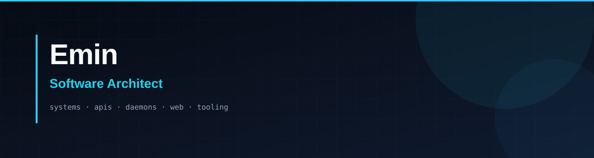
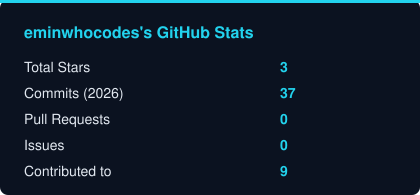
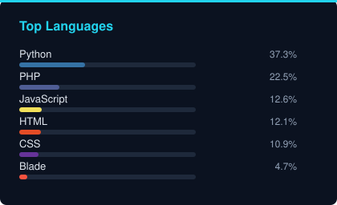
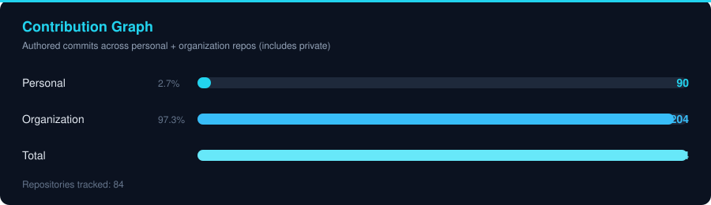

Designing and shipping systems end-to-end — from architecture and APIs to daemons, web apps, and the tooling around them. I lead delivery with a small team and care about clear boundaries, reliable ops, and maintainable code.

 

## Tech Stack

  

  
  
  

## Team

  

## Focus Areas

  
  
  
  
  

## Activity

<!-- Local cards regenerated by scripts/generate-stats.ps1 — aggregates private + public + org (no repo names). -->

  
  

 

  

## Public Highlights

| Project | What it is |
|:--------|:-----------|
| **[pc-yer-acma](https://github.com/eminwhocodes/pc-yer-acma)** | Windows disk usage analyzer with Docker/Drive cleanup UI |
| **[gnu-todo](https://github.com/eminwhocodes/gnu-todo)** | Shell tooling |
| **[dev-toys-onayliyorum](https://github.com/eminwhocodes/dev-toys-onayliyorum)** | C# utility |
